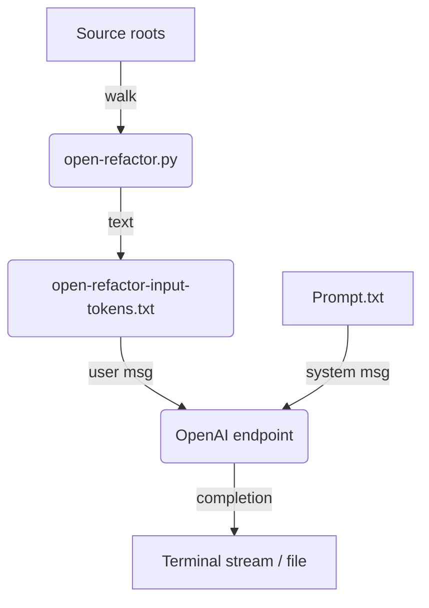

# REBOOT  
**R**Eboot **E**xtends **B**inary reverse‑engineering via **O**ver‑RDMA‑Paged‑Attention & **O**penAI‑API **T**ransforms  

---

## 0 . AI for RE

* **What?** &nbsp;A single‑file Python 3 CLI (`open‑refactor.py`) that can
  *harvest* arbitrarily large codebases—including embedded binaries—into a
  token‑friendly text bundle **and** push it (plus your system prompt) to any
  OpenAI‑compatible Chat Completions endpoint.

* **Why?** &nbsp;Feed a *long‑context* LLM (gpt‑4o‑long, home‑grown 10 M‑token
  model, etc.) everything it needs for a **one‑shot refactor, audit, or reverse
  engineering pass**—no retrieval plugin required.

* **Who?** &nbsp;Teams with a DGX, H100 pods, or an Azure “giga‑context” model
  subscription who want to modernise or unmangle legacy monorepos *fast*.

---

## 1 . Features at a Glance

| Category | Highlights |
|----------|------------|
| **Harvest** | Multi‑root crawl, VCS‑dirs ignored, text streamed line‑wise, binary options (omit / Base‑64 / disassembly). |
| **Token‑aware** | Counts tokens (exact with `tiktoken`, heuristic fallback), prints a **budget table**, aborts if you exceed the model’s context (unless `--allow-overflow`). |
| **Push‑button upload** | Reads system prompt from file, sends **system** + **user** messages to any OpenAI endpoint; streams replies live. |
| **Memory‑safe** | No file read fully into RAM unless < 10 MB *and* needed for token precision. |
| **Portable** | Pure std‑lib unless you enable extras (`openai`, `tiktoken`, `objdump`, `Ghidra`). Works on Linux, macOS, Windows. |

---

## 2 . Prerequisites

| Purpose | Package | Install |
|---------|---------|---------|
| 🗣️ Chat API | `openai>=1.6` | `pip install --upgrade openai` |
| 🔢 Accurate token count | `tiktoken>=0.5` *(optional)* | `pip install tiktoken` |
| 🛠️ Disassembly | `objdump` *(GNU binutils)* | system package manager |
| 🔎 Deep binary analysis | **Ghidra** *(optional)* | download & set `GHIDRA_INSTALL_DIR` |

Python ≥ 3.8 is required.

---

## 3 . Installation

```bash
git clone https://github.com/arthurrasmusson/REBOOT.git
cd REBOOT
python -m pip install -r requirements.txt    # pulls openai + tiktoken
chmod +x open-refactor.py                    # or: ln -s …/open-refactor.py ~/bin/reboot
````

---

## 4 . Anatomy of `open-refactor.py`

```text
██ HARVEST
   ├─ process_root()
   │   ├─ directory listing block
   │   └─ per‑file blocks (text vs binary)
   └─ output → open-refactor-input-tokens.txt   (UTF‑8)

██ TOKEN REPORT
   ├─ estimate_file_tokens()   – precise if <10 MB & tiktoken, else heuristic
   ├─ context window lookup    – table in script (edit for custom IDs)
   └─ abort/warn if overflow   – unless --allow-overflow

██ UPLOAD (optional)
   ├─ Reads system prompt (--path-to-refactor-prompt)
   ├─ Configures endpoint (--openai-base-url)
   └─ Streams reply or waits (default stream, --openai-no-stream for full)
```

### Key Data Flow



*(Diagram rendered by GitHub’s Mermaid)*

---

## 5 . Command‑line Cheat‑Sheet

```bash
# Minimal harvest
open-refactor.py --root-source-path PATH [...]

# Include objdump summaries of binaries
open-refactor.py [...] --collect-binary-disassembly

# Base‑64 embed binaries (inflates size!)
open-refactor.py [...] --collect-binaries-full

# Produce file AND push to model
export OPENAI_API_KEY=sk-...
open-refactor.py [...] \
    --path-to-refactor-prompt prompt.md \
    --openai-model gpt-4o-long

# Offline / air‑gapped – skip upload
open-refactor.py [...] --skip-upload

# Ignore overflow warning (e.g. for 10 M‑token custom model)
open-refactor.py [...] --allow-overflow

# Control expected completion budget
open-refactor.py [...] --max-output-tokens 2048
```

---

## 6 . Token Budget Output

At every run you’ll see something like:

```text
[Token budget]  System:  184   +  User: 9,881,462  +  Overhead: 8
  = INPUT 9,881,654  |  Planned output 4,096  =>  TOTAL 9,885,750 tokens
[!] WARNING: total tokens (9,885,750) exceed gpt-4o context (128,000).
```

Actions:

* **Reduce input** – split repo, remove third‑party libs, omit binaries.
* **Pick bigger model** – e.g. `gpt-4o-long`.
* **`--allow-overflow`** – if your endpoint actually supports more.

---

## 7 . Binary Handling Matrix

| Flag combo                     | Effect in output                                  | When to use                                                          |
| ------------------------------ | ------------------------------------------------- | -------------------------------------------------------------------- |
| *(default)*                    | `"[note that this file was omitted]"` placeholder | You only need symbols/file names.                                    |
| `--collect-binary-disassembly` | `objdump -d` (first 20 kB) or Ghidra report       | You need inline asm to refactor adjacent C/C++ code.                 |
| `--collect-binaries-full`      | Base‑64 blob                                      | Rare; maybe you’ll pipe bytes into an LLM able to decompile raw ELF. |

---

## 8 . End‑to‑End Example

```bash
# Harvest two NVIDIA repos, get disassembly, push to Azure OpenAI,
# stream model output to a markdown patch file.

open-refactor.py \
  --root-source-path ~/src/tensorrt-llm \
  --root-source-path ~/src/libnvinfer \
  --collect-binary-disassembly \
  --output /tmp/trt_bundle.txt \
  --path-to-refactor-prompt prompts/upgrade_cuda12.md \
  --openai-base-url https://mycompany.openai.azure.com/openai/deployments/v4 \
  --openai-model gpt-4o-long \
  --max-output-tokens 8192 \
  | tee /tmp/patch.md
```

---

## 9 . Security Considerations

* **Secrets** – The harvest is literal. Add `.env`, `*.pem`, etc. to a
  `.rebootignore` *(feature planned)* or run a scrub pass before upload.
* **Licensing** – Third‑party source may not allow uploading to OpenAI; audit data.
* **Cost** – 10 M tokens ⇢ \$\$\$.  Verify with `--skip-upload` first.

---

## 10 . Limitations / Roadmap

* **No incremental diff** – always full‑repo upload. Chunking/RAG mode TBD.
* **Ghidra headless** – The script currently calls `objdump` only; a richer
  `--collect-binary-disassembly-ghidra` flag is planned.
* **Windows objdump** – require MSYS or LLVM `llvm-objdump`.

---

## 11 . Contributing

1. Fork → Branch → PR.
2. Run `python -m pip install -r requirements-dev.txt && make lint test`.
3. Ensure new features have docstrings + README update.

---

## 12 . License

AGPLv3

---

## 13 . Reverse Acronym (because why not?)

> **R**Eboot **E**xtends **B**inary reverse‑engineering via **O**ver‑RDMA‑Paged‑Attention & **O**penAI‑API **T**ransforms

